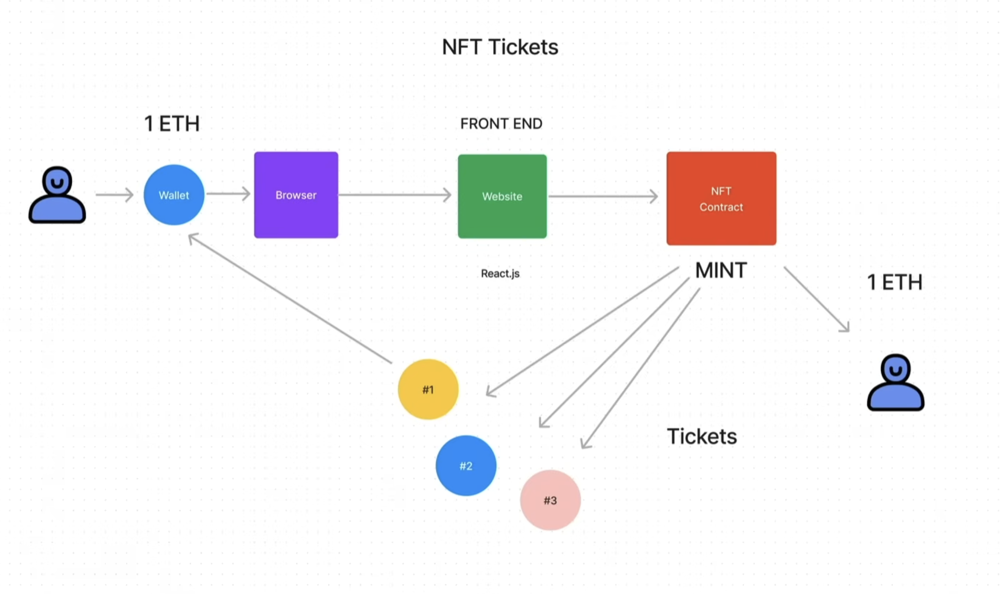

# TicketsDapp

A simple Web3 "Ticketmaster"-style decentralized application built for study and practice. It lets users browse events and purchase numbered seats via a smart contract. This repository is intentionally minimal, and there are many opportunities for improvement and extension.

## Purpose
This project exists primarily for learning purposes. Expect rough edges and room for enhancements across the smart contract, frontend layout (including the seating chart), and developer experience. Contributions and experiments are welcome.

## Flow
The high-level flow from UI to blockchain is illustrated below:

## Tech Stack
- Solidity (smart contract)
- Hardhat (development, testing, local blockchain)
- Ethers.js (blockchain interaction in the frontend)
- React (frontend UI)

## Prerequisites
- Node.js and npm installed
- Optional: A modern browser with MetaMask (or another Ethereum provider) for testing

## Getting Started
1. Install dependencies:
   - `npm install`

2. Start a local Hardhat blockchain (network id 31337 by default):
   - `npx hardhat node`

3. In a separate terminal, deploy the contract to the local network:
   - `npx hardhat run scripts/deploy.js --network localhost`

   After deployment, the contract address will be printed. The app reads from `src/config.json` (preconfigured for network `31337`). If you deploy to a different network or the address changes, update `src/config.json` accordingly.

4. Start the React frontend:
   - `npm start`

   This will launch the app on `http://localhost:3000/`. Make sure your browser/provider is connected to the same network as your local Hardhat node.

## Notes
- Seats are numbered and validated on-chain. Buying a ticket mints a token and marks the seat as taken.
- The seating layout is a work-in-progress and may evolve. If you see visual issues, feel free to adjust the layout logic in `src/components/SeatChart.js` and related CSS in `src/index.css`.
- Tests for the smart contract can be found under `test/`. You can run them with `npx hardhat test`.

## Learning Source
I learned and drew inspiration for this project from the following resource:
- Learn Blockchain & Solidity Development Full Course 2024 (YouTube): https://www.youtube.com/watch?v=jcgfQEbptdo